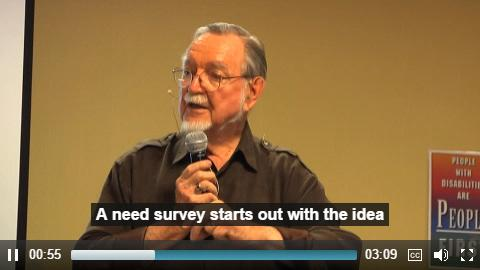

# Determining Community Need {#determining-community-need}

<h5>LEARNING OBJECTIVES FOR THIS SECTION</h5>
After completing this section, you will be able to...
<ul><li>Create a list of your community’s unique strengths and assets</li><li>Identify possible community partnerships</li><li>Find new and unique ways to address community needs</li></ul>

Libraries are a center of their communities. Your library might often host community events, perform outreach to different parts of your community (for example schools and/or daycares), or play a key role in community fundraising. Libraries are built to provide for their communities, and many libraries have different ways to determine community need. Some libraries host “town hall” style events to hear from their communities, while others might use online surveys. Knowing the needs of your community is likely something your library has already been working on. However, understanding the needs of your community in relation to your library’s unique capacity can help to strengthen an already strong system.

In our module on Community Mapping, we delve deeply into how to assess the assets and strengths of your community and develop a community map. Here, we will be covering the subject from a slightly different angle. We will be taking stock of resources your community already has, as identified in Community Mapping, and how these strengths can be leveraged to help supplement your library’s capacity. Our Community Mapping module can helps us survey the landscape, and we can use what we know to inform our library’s capacity and act on our findings.

**Community Assets**

Community assets can be as broad as entire organizations, or as specific as individuals. In this module, assets will be very similar to those conceptualized in the Community Mapping module. Here, they are framed in terms of their relation to your library’s capacity. The University of Kansas in their online Community Tool Box defines an asset as “anything that can be used to improve the quality of community life.” For our purposes today, we will define assets as follows:

**Individuals** are the backbone of communities. Often, your library might have individuals that volunteer to shelve books or organize “friends of the library” fundraising events. There might be a stay-at-home dad who organizes playgroups, or a retired bus driver that bakes large batches of her family’s famous cookies. Individuals in our communities are diverse in their strengths, and can help expand the staffing capacity of your library.

**Places** can be physical, like a large building, or structural like a park or an open field. Schools, hospitals, even empty and unused spaces can be community assets. These places can help to expand the physical capacity of your library.

**Services** are assets that help to improve the quality of life for your community. They can be as simple as bus routes and other public transportation, or as complex as cultural organizations or childhood development centers. These services can often supplement and expand your library’s capacity in partnerships and outreach services.

**Businesses** can be large businesses like coffee chains or technology developers, or small businesses that are locally owned and operated. When thinking about the businesses in your community, it is important to think even as small as businesses like food trucks or ones that might be operating out of a community member’s garage. Every business has the opportunity to support your library and your community. Businesses often supplement a variety of capacities, including technology, space, partnerships, and staffing.

<h5>Professor John McKnight on Community Assets</a></h5>

Let’s take a moment to reflect on the community that your library serves. As you do this, bring up the map you created in the Community Mapping module.Think about the people, places, services and businesses that make up your community that you marked on this map. It can be helpful to visualize your Community Map in relation to their strengths and assets, and can be done in a very similar way to assessing the capacity of your library. As you are doing this, keep in mind which assets and strengths might be the most helpful in relation to your library’s capacity. Here’s an example:

**Midsize Library Community Assets &amp; Strengths**

Let’s use the same midsize library from our example in the beginning of the module. First, we will make a list of our community assets in each category:

| Type of Asset  | Asset Name |
| --- | --- |
| **Individuals** | <ul><li>Anne Park--Software engineer</li><li>Ray Neng--Renovator</li><li>Richard Bell--Commercial baker</li><li>Holly Lampard--Mechanical engineer</li></ul>|
| **Places** | <ul><li>Parkland Elementary</li><li>Orchard Ridge High School</li><li>Red Mark Burgers</li><li>Parkland Church</li><li>Greenriver Park</li></ul> |
| **Services** | <ul><li>Community Transit</li><li>Early Beginnings Childhood Center</li><li>Boys and Girls Club</li><li>Orchard Ridge Cultural Center</li></ul> |
| **Businesses** | <ul><li>Red Mark Burgers</li><li>Kern Writing &amp; Math Tutoring</li><li>Starbanks</li><li>Guaco’s Taco Truck</li><ul> |

Then, we will expand to list their strengths:

| Type of Asset  | Asset Name | Strengths |
| --- | --- |
| **Individuals** | <ul><li>Anne Park--Software engineer</li><li>Ray Neng--Renovator</li><li>Richard Bell--Commercial baker</li><li>Holly Lampard--Mechanical engineer</li></ul>|<ul><li>Technological knowledge</li><li>Master carpenter</li><li>Digital artist and knitter</li><li>Engineer and 3D designer</li></ul>|
| **Places** | <ul><li>Parkland Elementary</li><li>Orchard Ridge High School</li><li>Red Mark Burgers</li><li>Parkland Church</li><li>Greenriver Park</li></ul> |<ul><li>Large community space</li><li>Hi-tech theater, computer lab with over 30 seats</li><li>Often hosts fundraisers</li><li>Community dinners</li><li>Large open field</li></ul>
| **Services** | <ul><li>Community Transit</li><li>Early Beginnings Childhood Center</li><li>Boys and Girls Club</li><li>Orchard Ridge Cultural Center</li></ul> |<ul><li>Buses run until midnight</li><li>Childhood development knowledge</li><li>Afterschool programs</li><li>Community space and community contacts</li></ul>|
| **Businesses** | <ul><li>Red Mark Burgers</li><li>Kern Writing &amp; Math Tutoring</li><li>Starbanks</li><li>Guaco’s Taco Truck</li><ul> |<ul><li>Same as above</li><li>Tutoring and homework help, teen volunteer contacts</li><li>Caters coffee and pastries</li><li>Catering, community contacts</li></ul>

**Reflection**

Now it is your turn--what are the assets in your community? What strengths do they bring to the table? Take a moment to reflect, using your Community Map to help you.

**Community Needs**

Now that we have briefly revisited how to assess community assets and strengths and reframed in terms of our library’s capacity, we are well prepared to think deeply about community needs. In the following section, we will also be covering how we might be able to leverage the strengths in our community to meet those needs.

**Leveraging Community Assets to Address Community Needs**

>“Each time a person uses his or her capacity, the community is stronger and the person more powerful. That is why strong communities are basically places where the capacities of local residents are identified, valued, and used.”  -- Kretzmann, J. P., &amp; McKnight, J. L. (1993). Building from the inside out: A path toward finding and mobilizing a community’s assets. Chicago, IL: ACTA Publications. P. 13.

The needs and assets of your community are two sides of the same coin. Being able to map out both your community assets and your community needs gives you a comprehensive picture of your library’s capacity in relation to its unique community. Community needs can include the needs of community organizations, groups, and individuals. A good example of a community organization need is the lack of a meeting space, or perhaps funding to cover organization activities. A need on the individual level includes things like accommodation needs, or the need for clean drinking water. Examining your community closely can help you to understand what gaps exist between what is currently available and what should be available.

Community needs and assets connect directly with assessing the capacity of your library. What are your capacity needs? How are they related to community needs? What assets can you leverage to fill these gaps?

When assessing community needs it is important to collect information from as many members of the community as possible. Luckily, you’ve already identified some tools to do this in our Community Mapping module, in section 3.4 “Learn About Your Community Assets.” In this section we will be discussing additional tools that you can use which are especially strong when assessing your library’s capacity and community needs. As a starting point, brainstorming about your community and identifying the groups that make up your community can be helpful. Talking with other workers in your library, as well as patrons, can help you to make sure you have not left any community members out of your analysis. From here, there are a variety of next steps that you can follow to assess the needs of your community.

| **ASSESSMENT TECHNIQUES **|
| --- | --- |
| **Informal Interviews** | **Informal interviews** are open-ended interviews that do not require you to use a tape recorder. Because of this, they can be an accessible way to interact with your community in a non-intimidating manner.
Much like “On the Street Interviews,” informal interviews can be performed in your library, outside in the community, at the grocery store... the opportunities are endless.<ul><li><b>Step 1:</b> Prepare a few questions to ask ahead of time</li><li> Step 2: Memorize the essence of one or two questions (it does not have to be word for word)</li><li><b>Step 3:</b> Ask these questions on the fly while in conversation with your community</li><li><b>Step 4: Write a summary of the conversation afterwards for future reference</li></ul>
| **Town Halls** | **Town Halls** are planned get togethers with your community where you discuss current issues, events, and other information. These are similar to focus groups, which we covered in Community Mapping.
Town Halls can be formal or  informal, and can be conducted simply as community “get togethers” with coffee, snacks, and a few questions asked for the group to answer after you’ve done some mingling or tackled other library business. 
This is an example of how an informal town hall event brought residents together into a shared space that was less intimidating: http://www.courant.com/community/bloomfield/hc-news-bloomfield-town-hall-meeting-20180123-story.html
Here is an example of how Anne Arundel County Public Library performed formal town halls regarding budget cuts: https://www.urbanlibraries.org/town-hall-meetings-innovation-246.php?page_id=103 |
| **Other Informal Methods** | Other informal methods include: <ul><li> <b>“Postcard Surveys”</b> where you send a postcard with close ended questions and community members can mark it and mail it back</li><li><b>Using the “Grape Vine”</b> by asking a key member of a certain organization to ask their members a few questions and get back to you with their answers</li><li><b>Observation:</b> attending community events, organizations, schools, and other locations where your community meets and simply observing. What are some issues being raised?</li></ul>|

Once you have used one or more of these methods to collect information about your community and their needs, you can map these out visually. Here is an example using our favorite midsize library:

| **Community** | **Name** | **Needs** |
| --- | --- | --- |
| **Individuals** | <ul><li>Carmen</li><li>Alan</li><li>Elaine</li></ul> | <ul><li>Better wheelchair access</li><li>Resume and job training</li><li>-Sensory friendly lighting</li></ul>|
| **Groups** | <ul><li>Teens</li><li>Parents</li><li>Deaf Community</li><li>Autistic Community</li></ul> | <ul><li>Cooperative learning space</li><li>Stroller parking</li><li>ASL speakers</li><li>Staff sensitivity training</li></ul> |
| **Associations** | <ul><li>Neighborhood Association I</li><li>Neighborhood Association II</li><li>PTA</li></ul> | <ul><li>More Farsi language books and materials</li><li>New member recruitment through posters, etc.</li><li>Additional meeting space</li></ul> |
| **Institutions** | <ul><li>Parkland Elementary School</li><li>Harbor Middle School</li><li>Orchard Ridge High School</li></ul> | <ul><li>Technology programs for elementary students</li><li>Tween library representation and materials</li><li>Additional teen services outreach</li></ul> |

You may have noticed that this map lists the needs of community members in relation to our Midsize library. We encourage you, in your own assessment, to list the needs of your community members that don’t necessarily relate to your library in addition to this list. These can include needs like: resources access for your homeless community, musical instruments for the high school band, and more. While ways to support your community in these needs might not be obvious at first, knowing that the needs exist can help your library to provide supplemental resources. For example, while your library cannot provide laundry machines for your homeless youth, it can provide pamphlets with maps marking where safe facilities like that are freely available.

<h5>ADDITIONAL RESOURCES</h5>
<ul><li>https://www.slj.com/2014/06/public-libraries/know-your-neighborhood-a-community-needs-assessment-primer/#_</li><li>https://ctb.ku.edu/en</li></ul>

