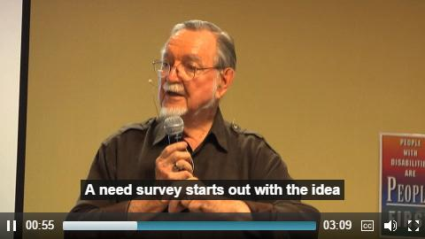

## **Professor John McKnight on Community Assets** {#professor-john-mcknight-on-community-assets}

http://mn.gov/mnddc/mcKnight/johnMcKnight2_02.html

Let’s take a moment to reflect on the community that your library serves. As you do this, bring up the map you created in the Community Mapping module.Think about the people, places, services and businesses that make up your community that you marked on this map. It can be helpful to visualize your Community Map in relation to their strengths and assets, and can be done in a very similar way to assessing the capacity of your library. As you are doing this, keep in mind which assets and strengths might be the most helpful in relation to your library’s capacity. Here’s an example:

**Midsize Library Community Assets &amp; Strengths**

Let’s use the same midsize library from our example in the beginning of the module. First, we will make a list of our community assets in each category:

|  | Asset Name |
| --- | --- |
| **Individuals** | 

*   Anne Park--Software engineer
*   Ray Neng--Renovator
*   Richard Bell--Commercial baker
*   Holly Lampard--Mechanical engineer

 |
| **Places** | 

*   Parkland Elementary
*   Orchard Ridge High School
*   Red Mark Burgers
*   Parkland Church
*   Greenriver Park

 |
| **Services** | 

*   Community Transit
*   Early Beginnings Childhood Center
*   Boys and Girls Club
*   Orchard Ridge Cultural Center

 |
| **Businesses** | 

*   Red Mark Burgers
*   Kern Writing &amp; Math Tutoring
*   Starbanks
*   Guaco’s Taco Truck

 |

Then, we will expand to list their strengths:

|  | Asset Name | Strengths |
| --- | --- | --- |
| **Individuals** | 

*   Anne Park
*   Ray Neng
*   Richard Bell
*   Holly Lampard

 | -Technological knowledge |
| **Places** | 

*   Parkland Elementary
*   Orchard Ridge High School
*   Red Mark Burgers
*   Parkland Church
*   Greenriver Park

 | -Large community space |
| **Services** | 

*   Community Transit
*   Early Beginnings Childhood Center
*   Boys and Girls Club
*   Orchard Ridge Cultural Center

 | -Buses run until midnight |
| **Businesses** | 

*   Red Mark Burgers
*   Kern Writing &amp; Math Tutoring
*   Starbanks
*   Guaco’s Taco Truck

 | -Same as above |

**Reflection**

Now it is your turn--what are the assets in your community? What strengths do they bring to the table? Take a moment to reflect, using your Community Map to help you.

**Community Needs**

Now that we have briefly revisited how to assess community assets and strengths and reframed in terms of our library’s capacity, we are well prepared to think deeply about community needs. In the following section, we will also be covering how we might be able to leverage the strengths in our community to meet those needs.

**Leveraging Community Assets to Address Community Needs**

_“Each time a person uses his or her capacity, the community is stronger and the person more powerful. That is why strong communities are basically places where the capacities of local residents are identified, valued, and used.” -- Kretzmann, J. P., &amp; McKnight, J. L. (1993). Building from the inside out: A path toward finding and mobilizing a community’s assets. Chicago, IL: ACTA Publications. P. 13._

The needs and assets of your community are two sides of the same coin. Being able to map out both your community assets and your community needs gives you a comprehensive picture of your library’s capacity in relation to its unique community. Community needs can include the needs of community organizations, groups, and individuals. A good example of a community organization need is the lack of a meeting space, or perhaps funding to cover organization activities. A need on the individual level includes things like accommodation needs, or the need for clean drinking water. Examining your community closely can help you to understand what gaps exist between what is currently available and what should be available.

Community needs and assets connect directly with assessing the capacity of your library. What are your capacity needs? How are they related to community needs? What assets can you leverage to fill these gaps?

When assessing community needs it is important to collect information from as many members of the community as possible. Luckily, you’ve already identified some tools to do this in our Community Mapping module, in section 3.4 “Learn About Your Community Assets.” In this section we will be discussing additional tools that you can use which are especially strong when assessing your library’s capacity and community needs. As a starting point, brainstorming about your community and identifying the groups that make up your community can be helpful. Talking with other workers in your library, as well as patrons, can help you to make sure you have not left any community members out of your analysis. From here, there are a variety of next steps that you can follow to assess the needs of your community:

| **Informal Interviews** | **Informal interviews** are open-ended interviews that do not require you to use a tape recorder. Because of this, they can be an accessible way to interact with your community in a non-intimidating manner. |
| --- | --- |
| **Town Halls** | **Town Halls** are planned get togethers with your community where you discuss current issues, events, and other information. These are similar to focus groups, which we covered in Community Mapping. |
| **Other Informal Methods** | Other informal methods include: |

Once you have used one or more of these methods to collect information about your community and their needs, you can map these out visually. Here is an example using our favorite midsize library:

| **Community** | **Name** | **Needs** |
| --- | --- | --- |
| **Individuals** | 

*   Carmen
*   Alan
*   Elaine

 | -Better wheelchair access |
| **Groups** | 

*   Teens
*   Parents
*   Deaf Community
*   Autistic Community

 | -Cooperative learning space |
| **Associations** | 

*   Neighborhood Association I
*   Neighborhood Association II
*   PTA

 | -More Farsi language books and materials |
| **Institutions** | 

*   Parkland Elementary School
*   Harbor Middle School
*   Orchard Ridge High School

 | -Technology programs for elementary students |

You may have noticed that this map lists the needs of community members in relation to our Midsize library. We encourage you, in your own assessment, to list the needs of your community members that don’t necessarily relate to your library in addition to this list. These can include needs like: resources access for your homeless community, musical instruments for the high school band, and more. While ways to support your community in these needs might not be obvious at first, knowing that the needs exist can help your library to provide supplemental resources. For example, while your library cannot provide laundry machines for your homeless youth, it can provide pamphlets with maps marking where safe facilities like that are freely available.

| **ADDITIONAL RESOURCES** |
| --- |